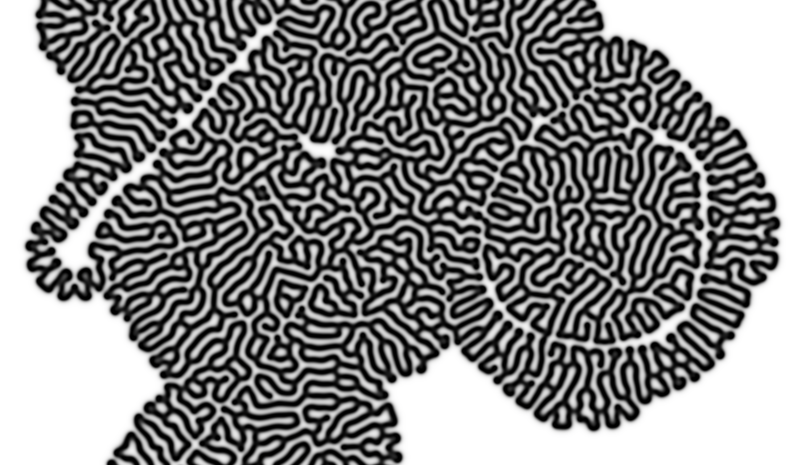
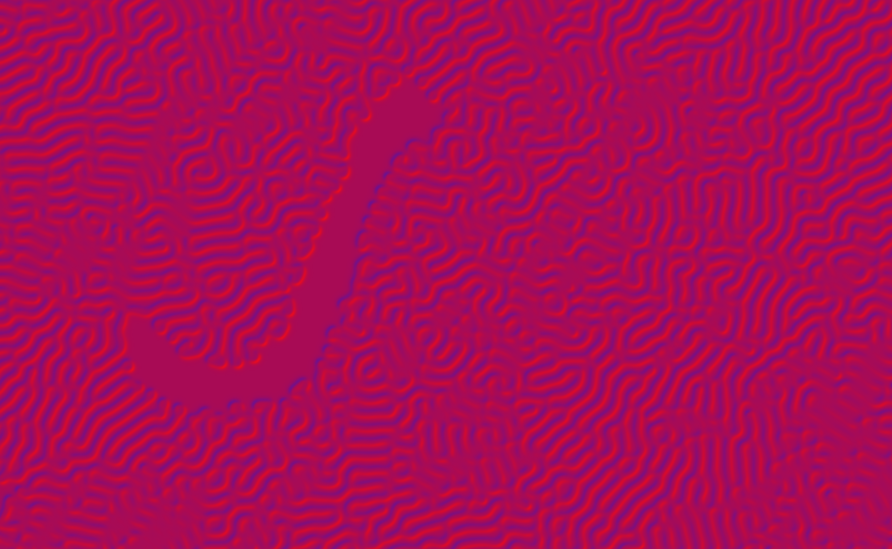

# Final Project: Reaction Diffusion

Charles Wang\
PennKey: chawang

[Live Demo](http://charlesliwang.com/Reaction-Diffusion/)

## Midpoint Milestone Report

"Ping-Pong"-ing frame buffers set up (OpenGLRenderer.ts, see: renderFromPrev(), renderToPrev() / compute-frag.glsl / echo-frag.glsl)

Basic algorithm implemented (compute-frag.glsl)\
right now kill/feed rates are hardcoded, but can be user defined (once I figure out what the good ranges are)

Basic normal computation from heighfield (basic-normals-frag.glsl)

User input: Mouse interaction, toggling shading, simulation rate (simply changes the number of iterations in 1 tick call, going over 5 iterations goes below 60fps on my laptop) (main.ts)
