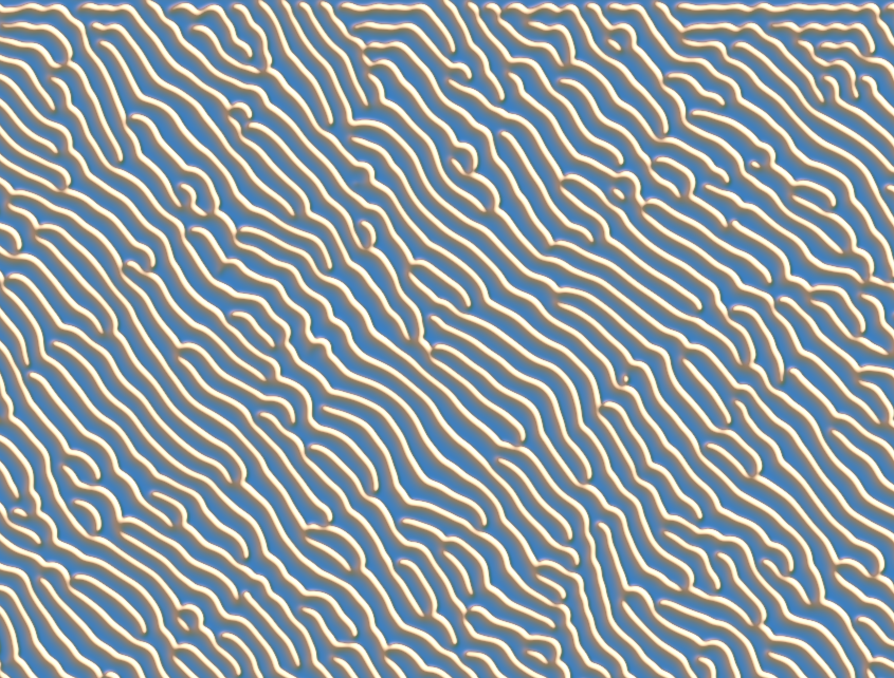

# Final Project: Reaction Diffusion

Charles Wang\
PennKey: chawang

This write up contains screenshots of this program, but it's much more engaging in the 

## [Live Demo](http://charlesliwang.com/Reaction-Diffusion/)

This project is an visual experiment using the [Gray-Scott Reaction Diffusion model](http://www.karlsims.com/rd.html). Please read the linked article for a full description of the technique. \
tl;dr: Each pixel contains some quantity of virtual molecule A and B and the concentration of each molecule will grow or die based on the density of neighboring pixels.\
Not only can you modify the uniform feed/kill (f/k) rates of the simulation, but you can also vary it by the pixel's positions. This write up will discuss different methods of doing so and how you can play around with and combine these methods in the live demo.

| Grayscale        | Gold-ish shader           |
| ------------- |-------------|
|       | 

## Features

### Horizontal Waves 
By choosing the "Horizontal Waves" option, the feed and kill rates will interpolate across the screen and offset by different speeds. This way the state of the simulation is rapidly cycling through different styles, creating an infinite sequence of unexpected patterns.

### x: feed, y: kill
The "x: feed, y: kill" option will create a similar experience except the variation in kill rate will occur in the y-axis. This option will change the overall patterns more quickly.

### Noisy f/k
This option will use perlin noise to determine the feed and kill rates across the screen. The scale of these noise textures can be adjusted as well. 

### f/k visualization

You can also visualize the feed and kill rates as colors for a clearer understanding of how different combinations affect the patterns.

| Horizontal        | x: feed, y: kill            |
| ------------- |-------------|
|       | 

| Horizontal f/k Vis        | Noisy f/k Vis           |
| ------------- |-------------|
|       | 

### Diffusion Direction
You can also introduce a weighting such that certain directions will diffuse more quickly. The influence of neighboring pixels in the specified direction is stronger. With the default f/k rates, this effect creates lines that are perpendicular to the specified direction.

#### Mouse Diffusion Direction
Checking "useMouseClick" will strengthen the diffusion influence in the direction towards the last mouse click. For the default f/k rates, this creates a circular pattern.

| Uniform Diffusion Direction        | Mouse Specified Diffusion           |
| ------------- |-------------|
|       | 

